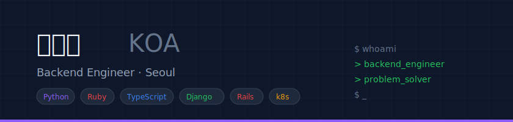
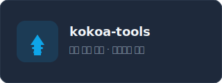
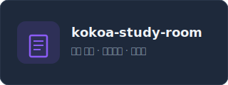
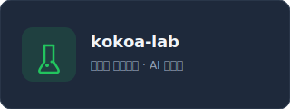

  

## 👋 About

파악하고 바로 움직이는 백엔드 엔지니어입니다.  
설계 → 구현 → 공유의 사이클을 빠르게 돌리며, 필요하면 인프라·프론트엔드·AI까지 직접 만들고 운영합니다.

- 🏢 **(주) 그렙 (프로그래머스)** — 채용서비스팀 · 교육솔루션팀 · 알고리즘 컨텐츠팀 (3년 3개월)
- 🎓 **국민대학교** 소프트웨어학부 (2026.08 졸업 예정 · GPA 4.42/4.5)
- 🌐 [Portfolio](https://www.shinkeonkim.com/my-portfolio/) · [Resume](https://www.shinkeonkim.com/my-resume/) · [Blog](https://shinkeonkim.com/)

---

## 🛠 Tech Stack

**Languages**

**Backend & Framework**

**Infrastructure & DevOps**

**Database**

---

## 💼 Experience

| 기간 | 소속 | 역할 |
|------|------|------|
| 2024.07 ~ 2025.03 | 그렙 · 교육솔루션팀 | Backend Engineer (Rails, Django) |
| 2020.12 ~ 2022.10 | 그렙 · 채용서비스팀 | SW Engineer (Rails, Vue.js, AWS) |
| 2022.11 ~ 2024.05 | 육군 특전사령부 | 정보체계운용정비병 |
| 2019.06 ~ 2020.08 | 그렙 · 알고리즘 컨텐츠팀 | 알고리즘 컨텐츠 제작자 (인턴 3차) |

---

## 🚀 Featured Projects

| 프로젝트 | 설명 | 기술 |
|---------|------|------|
| **[미핏 · meFit](https://www.shinkeonkim.com/my-portfolio/projects/mefit)** | AI 가상면접 훈련 플랫폼 | Django, Celery, k3s, LangChain, AWS Lambda |
| **[Athena](https://www.shinkeonkim.com/my-portfolio/projects/athena)** | 인터랙티브 AI 알고리즘 학습 플랫폼 | Django, Rust, gRPC, Docker, LLM |
| **[깜빡이 💡](https://www.shinkeonkim.com/my-portfolio/projects/kkambbaki)** | 아동 집중력 향상 AI 교육 게임 | Django, Celery, k8s, ArgoCD |

---

## 🏅 Certifications & Awards

**자격증** — 정보처리기사 · ADsP · PCCP Lv.4 · SQLD · 네트워크 관리사 2급

**수상** — 캡스톤디자인 금상 · 크리에이터 경진대회 1등 · 멋사 해커톤 동상(2회)

---

## 🏠 Organizations

  
  
  

---

## 🎯 Activity

- **국민대 멋쟁이사자처럼** — 8, 9, 10, 12, 13기 운영진 · 대표 (2020 ~ 2025)
- **SW교육 강사** — 고등학교 Python/C언어 강의, 대학생 재능봉사

---

## 📊 Stats

  
  

  

📈 More Stats

 

---

  
  
  
  
  
  

